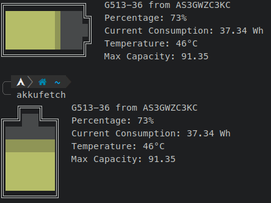

# Akkufetch

Akkufetch is a minimal, highly customizable tool that displays battery information.

## Example

</img>

## Configuration

Configurable through
``/etc/akkufetch.toml, ~/.config/akkufetch.toml``  
or by using the ``-c <config>`` flag.

If a value is not found in the ``~/.config/akkufetch.toml`` config it checks ``/etc/akkufetch.toml``and otherwise uses the default.

To migrate from the old .json config check the new keys in ``examples/akkufetch.toml``

## Installation

### From source
#### Dependencies
- python3
- dbus

``git clone https://github.com/mrHeavenli/akkufetch``
``chmod +x akkufetch/src/main.py``
``sudo mv akkufetch /usr/share``    
``ln -sf /usr/share/akkufetch/src/main.py /usr/bin/akkufetch``

### Arch Linux
``yay -S akkufetch-git``
